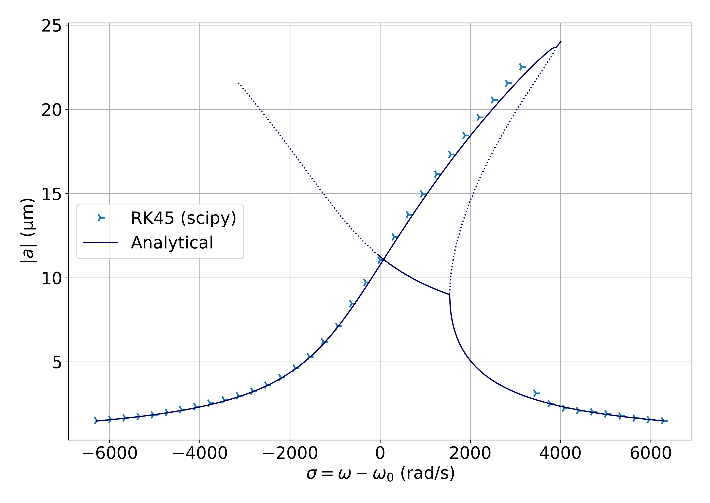

Programs used to numerically solve the "modified" Duffing equation, in the context of the [REIN experiment](https://journals.aps.org/prl/abstract/10.1103/PhysRevLett.133.223201) (nanoWire) in Stefan Willitsch's group at Basel university.

## Theory

Following [this article](https://journals.aps.org/pra/abstract/10.1103/PhysRevA.82.061402), the "modified" Duffing equation is :

$$
\ddot{x} + 2\mu\dot{x} + \gamma\dot{x}^3 + \omega_0^2x + \alpha x^3 = k\cos{\omega t}
$$

with solution for the amplitude as :

$$
\frac{9}{16}(\alpha^2 + \gamma^2\omega_0^6) a^6 + 3\omega_0(\mu\gamma\omega_0^3 - \sigma\alpha)a^4 + 4\omega_0^2(\sigma^2 + \mu^2)a^2 - k^2 = 0.
$$

The phase of the oscillator is :

$$
\tan{\varphi} = \frac{8\mu\omega_0}{3\alpha a^2 - 8\omega_0\sigma}.
$$

## Program

$\star$ `DDDAO_3.py` is the main program of this repository. It solves the modified Duffing equation using `solve_ivp` function from `scipy` module. The equation is solved for a range of parameters sweept during an experiment. This allows to modify several parameters at once for each step of the solution. To save memory usage only the last data points are saved for each frequency. The physics is based upon the work of N. Akerman et al., "[Single-ion nonlinear mechanical oscillator](https://journals.aps.org/pra/abstract/10.1103/PhysRevA.82.061402)," PRA 82, (2010). 

Plotting the amplitude of motion against the drive frequency shows good agrement with the theory.

